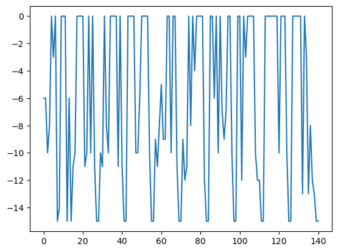

# Report Lab. 4: (Reduced) Variable Neighborhood Search 

**Table of Contents**

- [Variable Neighborhood Search](#variable-neighborhood-search)
	- [starting point](#starting-point)
	- [`kmax`](#kmax)
	- [Generation of neighborhood](#generation-of-neighborhood)
	- [`local_search`](#local_search)
- [Reduced Variable Neighborhood Search and Comparison](#reduced-variable-neighborhood-search-and-comparison)
	- [starting point](#starting-point)
	- [`kmax`](#kmax)
	- [Generation of neighborhood](#generation-of-neighborhood)
- [Conclusion](#conclusion)
- [Code implementations](#code-implementations)


## Variable Neighborhood Search 

### starting point
As seen for most of the optimization search algorithms, a **good starting point** (closer so the global optimum) will **reduce the cost of the search** since the process requires less step to reach the solution. As the `x0` is far from the global optimum, as the number of iterations grown.

In order to have a good analysis of the effect of the initial solution, I have generated a random binary vector `initial_point`. Based on the starting solution picked, the number of iterations varies; there are VNS lunches with more than 300 iterations and others with less than 140.

| `vns_result`                    | `vns_result`                    |
| ------------------------------- | ------------------------------- |
| [0. 1. 0. 0. 0. 1. 1. 1. 1. 1.] | [0. 0. 0. 0. 1. 1. 1. 1. 1. 1.] |
|           |           |

Even with this simple example, we can also observe that the **starting solution is also a sort of exploration-exploitation trade-off**. With a worse starting point, in fact, the algorithm is forced to spend time exploring new zones of the solution space.

### `kmax`
The maximum number of iterations set for each neighborhood is again an **exploration-exploitation trade-off**: a larger value of `kmax` shows more time spent within a particular neighborhood, while a lower value leads to more frequent restarts, which is useful to escape local optima but may cause useless computational overhead.

Here we can observe the VNS launched with the same function with the minimum and the maximum `kmax` available:

| `kmax = 1`             | `kmax = 11`            |
| ---------------------- | ---------------------- |
|  |  |

The results are quite clear: by setting **the number of iterations too low, we are not analyzing the current neighborhood structure properly;** on the other side, if this parameter is **too large, we are wasting iterations** in the structure, and we will instead prefer to move on.

The correct set is somewhere **in between**, in order to be able to explore deep each neighborhood, but without spending too much time in each one.

For the presented example a good trade off seem to be set `hmax = 4`.

### Generation of neighborhood 

After some experiments both the **quality and speed of the search are influenced similarity by the generation of the neighborhood** during the shaking step.    

If the generation is too limited, so **neighborhoods are too similar, the algorithm might get stuck in local optima**. Contrary, if we produce too **many diverse moves the computational cost increase**, as with a too high `hmax`, since the algorithm explores a vast number of potential solutions.

Basically the **same holds for the speed**: limited generations means few iterations but not be able to escape from local optimum, instead with more exploration we can reach a better solution,  but with more cost.

After implementing the 3 different `filp_` functions (see code on bottom) , the `flip1`, that flip k bits taken randomly in the binary vector x, provide more variability in respect the other two, that instead has lower level of perturbations. 

In particular the `filp2` has the minimum level of neighborhood diversification, since it just guarantees that at least one bit will always be flipped.

So what I expect is that `flip1` might be slower compared to `flip2` and `flip3` because it can potentially flip more bits, leading to more computational effort but, it will potentially lead to better exploration of the search space.

| `flip1`                 | `flip2`                 | `flip3`                 |
| ----------------------- | ----------------------- | ----------------------- |
|  |  |  |

In general, in order to reach the best solution it seems better to have a **generation of neighborhood quite "deep" instead of a less diversification**. Again, the solution is a trade-off balancement.  

### `local_search`

Even if with this simple problem the choice between best improvement and first improvement doesn't significantly affect the performance and behavior of the VNS algorithm, we can still notice that the first performs a **more complete** (and generally better) search, requiring so **more iterations**. The first improvement is instead **less cost** demanding but can **stuck** in local optima if the first improving solution is not globally optimal. 

| best improvement                  | first improvement           |
| --------------------------------- | --------------------------- |
|  |  |


---

## Reduced Variable Neighborhood Search and Comparison 

### starting point
Even if RVNS is again sensitive to the starting solution set, in general it **converges faster than VNS** and thank to its randomization, may exhibit **less sensitivity compared to VNS**.

Here we can notice the general **decrement of iterations required by RVNS** in confront to VNS starting from the same position and using the same function. 

| VNS                    | RVNS                 |
| ---------------------- | -------------------- |
|  |  |
### `kmax`
The max number of iteration here is less evident since the "steps are larger" and in general, for the considered problem, even with a large `kmax` the computational cost is restrained but the solution improves, so it **seems better to have this parameter relatively high**.    


### Generation of neighborhood 
Again, as for VNS, the **shake step has an important influence** on the algorithm's ability to explore the search space, even if the different ways of perturbations are less clear, the difference between `filip1` and `flip2` can be observed.

The fact that the `flip1` flips exactly `k` bits guarantee a better trade-off in respect to the ones that flips less bit. 

| `flip1`               | `flip2`               | `flip3`               |
| --------------------- | --------------------- | --------------------- |
|  |  |  |

It's true that due to both the simplicity of the problem and the use of a reduced neighborhood set, the effect of how the neighborhoods are generated seems smaller in the RVNS than in the VNS, but in general, we know that this is a **crucial point** for both algorithms.

---

## Conclusion

To sum up, for both VNS and RVNS, all **the parameters effect as a trade-off between the exploration and exploitation of the search space**, meaning that they influenced the time and the way that the algorithm used to spend in a specific neighborhood before passing to the next one.

Depending on the problem, so we have to decide how "deep" the search process should be in the neighboring area or, from the other perspective, how "fast" it is to move to new search zones.

**The starting solution affects the VNS more than the RVNS;** this one can in fact explore more regions of the search space, generating the new solutions randomly. Obliviously, the different implementations of the `local_search` are useless for the RVNS.

> The most important parameter is the **choice of the neighborhood structures**, this influenced most the performance of VNS and RVNS as well. 

This is evident both for the simple problem of the Knapsack and for most complex ones.


---
---

## Code implementations
In order to analyze in the behavior of the VNS and RVNS in the best way possible, I've implemented 3 different version of the `shake` function, as suggested, and the 2 version of the local_search, using so both the `first_improvement` and the `best_improvement`. Here the code: 

```python
def flip1(x, k): # flip k bits taken randomly in the binary vector x    
    xp = copy.deepcopy(x)
    # Generate k unique random indices to flip
    flip_indices = np.random.choice(len(x), size=k, replace=False)
    # Flip the selected bits
    for index in flip_indices:
        xp[index] = 1 - xp[index]

    return xp

def flip2(x, k): # flip max(1, k-1) bits in the binary vector x    
    xp = copy.deepcopy(x)
    # Generate k unique random indices to flip
    flip_indices = np.random.choice(len(x), size=max(1,k-1), replace=False)
    # Flip the selected bits
    for index in flip_indices:
        xp[index] = 1 - xp[index]

    return xp

def flip3(x, k): # flip at least k bits in the binary vector x   
    xp = copy.deepcopy(x)
    # Generate k unique random indices to flip
    flip_indices = np.random.choice(len(x), size=min(k,len(x)), replace=False)
    # Flip the selected bits
    for index in flip_indices:
        xp[index] = 1 - xp[index]

    return xp
```

```python
def best_improvement(f,x):
    best_x = copy.deepcopy(x)
    best_value = f(best_x)
    for i in range(len(x)):
        neighbor = shake(x, i + 1)

        # Evaluate the objective function value of the neighbor
        xp = f(neighbor)

        # Update the current best solution if the neighbor is better
        if xp < best_value:
            best_x = neighbor
            best_value = xp
            
    return best_x
            
            
def first_improvement(f,x):
    best_x = copy.deepcopy(x)
    best_value = f(best_x)
    for i in range(len(x)):
        neighbor = shake(x, i + 1)

        # Evaluate the objective function value of the neighbor
        xp = f(neighbor)

        # Update the current best solution if the neighbor is better
        if xp < best_value:
            return neighbor
            
    return best_x
```
