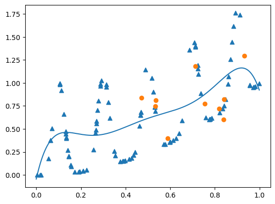

# Report Lab. 6 Bayesian Optimization

notebook : [optimtech_lab6](optimtech_lab6.ipynb)

**Table of Contents**

- [Prior Knowledge](#prior-knowledge)
	- [Kernel](#kernel)
- [Acquisition Function](#acquisition-function)
- [Objective function](#objective-function)
- [BONUS](#bonus)

## Prior Knowledge 
Prior knowledge plays a crucial role in Bayesian optimization, the initial surrogate in fact captures the relationship between the input variables and the objective function, so it reflect beliefs about the function's properties.

If we have information about the function's behavior and we embed it on the prior, the optimization process will look at promising regions of the search space.

Here the analysis on the behavior using the 3 differences prior surrogate functions: 

| prior 1          | prior 2                                | prior 3                                |
| ---------------- | -------------------------------------- | -------------------------------------- |
| X random array   | X from a uniform distribution [0.5, 1] | X from a uniform distribution [0, 0.5] |
|   |                         |                         |
| x=0.983, y=1.554 | x=0.966, y=1.489                       | x=0.982, y=1.376                       |

  
1. **`prior_1`**: it generates random points uniformly across the entire search space. It provides no bias towards any particular region of the search space. The optimization algorithm will start basically with no information about where the optimum and so it will need to explore the entire search space to discover good regions.
    
2. **`prior_2`**: it generates points uniformly distributed in the range `[0.5, 1]`. It biases the initial exploration towards the upper half of the search space. If the global optimum tends to occur in this region, the optimization process might converge faster compared to `prior_1`. However, if the optimum lies in the lower half of the search space, this prior might lead to slower convergence as it requires more exploration to find the optimal region.
    
3. **`prior_3`**:  it generates points uniformly distributed in the range `[0, 0.5]`. It biases the initial exploration towards the lower half of the search space. Similar to `prior_2`, if the global optimum tends to occur in this region, the optimization process might converge faster compared to `prior_1`. Conversely, if the optimum lies in the upper half of the search space, this prior might lead to slower convergence as it requires more exploration to find the optimal region.

### Kernel 
The kernel defines the covariance structure of the Gaussian process (GP) prior that is used to model the objective function.
The kernel affects the trade-off between exploration and exploitation : the ones with a large length scale may encourage more exploration, while a smaller length scale kernel may lead to more exploitation. Furthermore the kernel types can influence moothness or roughness in the function and some are more robust to noise (ex. Matérn kernel), while others (ex. squared exponential kernel) assume noise-free observations.

Here the different effects and some notes using some kernels available in `sklearn.gaussian_process.kernels`: 
Note: I've used different objective function based on the kernel properties. 

| RBF                                                                     | Matérn                                                                  | Rational Quadratic                                                      |
| ----------------------------------------------------------------------- | ----------------------------------------------------------------------- | ----------------------------------------------------------------------- |
| with `easy_objective`                                                   | with `complex_objective`                                                | with `complex_objective`                                                |
|  |  |  |

| **Exp-Sine-Squared**                                                    | Constant                                                                | White                                                                   |
| ----------------------------------------------------------------------- | ----------------------------------------------------------------------- | ----------------------------------------------------------------------- |
| with `multimodal_1`                                                     | with `easy_objective`                                                   | with `complex_objective`                                                |
|  |  |  |

1. **RBF (Radial Basis Function) Kernel**:
	- assumes smoothness in the underlying function 
	- Bayesian optimization tends to favor smooth functions without strong changes
2. **Matérn Kernel**:
	- flexibility in modeling functions with different degrees of smoothness 
	- robust to noise and can handle functions with abrupt changes or irregularities
3. **Rational Quadratic Kernel**:
    - allows modeling of complex patterns by combining multiple RBF kernels with different length scales
    - Bayesian optimization can capture both local and global variations in the function
4. **Exp-Sine-Squared Kernel**:
    - designed for modeling periodic phenomena by incorporating a sine function
    - Bayesian optimization is effective when optimizing functions with periodic behavior
5. **Constant Kernel**:
	- represents a constant function and is typically used to model the mean of the target variable
    - helps in estimating the baseline behavior of the function.
6. **White Kernel**:
    - represents noise in the data, helping the GP model account for observational noise
    - Bayesian optimization is more robust to noisy observations. It helps in making the optimization process less sensitive to outliers or measurement errors.
## Acquisition Function
The acquisition functions effect the Bayesian optimization controlling the **exploration-exploitation trade-off**. 

Different acquisition functions prioritize this trade-off differently and here an analysis on:
- Upper Confidence Bound (UCB)
- Probability of Improvement (PI)
- Expected Improvement (EI)

| UCB             | PI              | EI              |
| --------------- | --------------- | --------------- |
|  |  |  |

- **Upper Confidence Bound (UCB)**: the parameter `k` controls the balance between exploration and exploitation. Larger values of `k` lead to more exploration. In general UCB tends to explore widely initially and then gradually narrows down the search space as it identifies promising regions, so the balance is related to the mean and standard deviation such that for regions with high mean it search more and for the ones with more uncertainty it try to "escape" 
- **Probability of Improvement (PI)**: in general it prioritizes exploitation by selecting points with a high probability of improvement over the current best observation. At the PI favors exploitation by focusing on points with a high probability of improvement over the current best observation. 
- **Expected Improvement (EI)**: it try to balances exploration and exploitation by considering both the magnitude of improvement and uncertainty at candidate points. 

In summary:
- UCB and LCB focus on balancing exploration and exploitation by considering uncertainty
- PI prioritizes exploitation by selecting points with a high probability of improvement
- EI balances exploration and exploitation by considering both improvement magnitude and uncertainty 

As ever, the choice depends on the problem characteristics.

## Objective function

In general we can say that a complex function with many local optima can make it challenging for the optimization algorithm to find the global optimum. On the other hand, a simple, smooth, and well-behaved function can lead to quicker convergence.

To summarize, the nature of the objective function plays a crucial role in determining the effectiveness and efficiency of Bayesian optimization. 

Here the different behavior of the process using 3 different multimodal functions with PI. The first function has multiple local optima within each period, the second is more complex due to the interaction between the linear and sine terms (so more peaks and valleys) and the last is the more complex since it combines a quadratic term with a sinusoidal term raised to a high power.

| multimodal 1                    | multimodal 2           | multimodal 3            |
| ------------------------------- | ---------------------- | ----------------------- |
|                  |         |          |
|                                 |                        |                         |

| $\sin(x) + \sin(\frac{10}{3}x)$ | $(1.4-3.0x) \sin(18x)$ | $x^2 + \sin(5 \pi x)^6$ |
| ------------------------------- | ---------------------- | ----------------------- |

We can see how, **with an increasing complexity of the functions, the algorithms need to explore different peaks and valleys to identify all local optima, potentially requiring more evaluations** and, as yet seen, careful exploration and exploitation strategies.

Here another example in which I've define a complex and an easy objective function in this way:
1. Complex Objective Function:
	- $f(x) = (x - 0.3) \cdot \sin(10 \pi x) + 0.2 \cdot \sin(3 \pi x) + 0.5 \cdot e^{-\frac{(x - 0.7)^2}{0.01}}$
2. Easy Objective Function:
	- $f(x) = x^2 - 4x + 4$

And that's the Bayesian optimization applied:

| Complex Objective Function | Easy Objective Function |
| -------------------------- | ----------------------- |
|             |          |
 

## BONUS

Again, the **slack variable** `k` controls the balance between exploration (sampling points where uncertainty is high) and exploitation (sampling points with high predicted values). A larger value of `k` encourages more exploration, potentially leading to a broader search across the input space. Conversely, a smaller `k` emphasizes exploitation, focusing more on exploiting the current best-known areas of the function.

Here a visual example using as kernel `Matern` and acquisition function `EI`

| k = 0.01                                                                | k = 0.1                                                                 | k = 1.0                                                                 |
| ----------------------------------------------------------------------- | ----------------------------------------------------------------------- | ----------------------------------------------------------------------- |
|  |  |  |

- k = 0.01: optimization will primarily focus on exploitation
- k = 0.1: balance between exploration and exploitation
- k  = 1.0: optimization will focus more on exploration

---